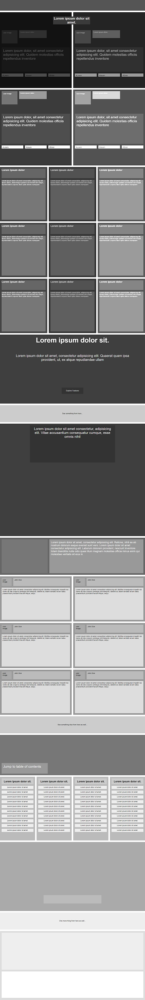

# Smashing magazine heatmap

> A gray scale heatmap for the smashing magazine website.

## Screenshot

## Live Preview

Click [here](https://raw.githack.com/aldemeery/smashing-mag-heatmap/develop/index.html) for a live preview.

## Authors

👤 **Osama Aldemeery**

- Github: [@aldemeery](https://github.com/aldemeery)
- Twitter: [@aldemeery](https://twitter.com/aldemeery)
- Linkedin: [osamaaldemeery](https://linkedin.com/in/osamaaldemeery)

👤 **Santiago Rodriguez**

- Github: [@santiagorodriguezbermudez](https://github.com/santiagorodriguezbermudez)
- Twitter: [@srba87](https://twitter.com/srba87)
- Linkedin: [srba87](https://www.linkedin.com/in/srba87/)

## 🤝 Contributing

Contributions, issues and feature requests are welcome!

Feel free to check the [issues page](issues/).

## Show your support

Give a ⭐️ if you like this project!

## 📝 License

This project is [MIT](LICENSE) licensed.
